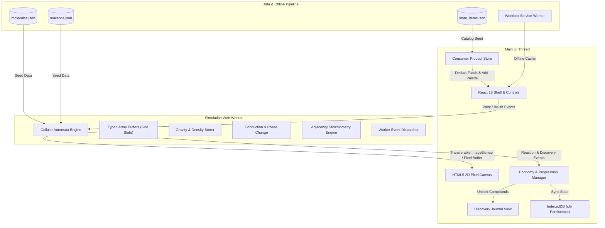

# ReactaGrid Architecture Specification

ReactaGrid is a high-performance, offline-capable 2D "falling sand" cellular automata chemistry sandbox and game. Its core mission is to bring empirical, real-world chemical interactions to life in a fast, 60 FPS mobile-first Progressive Web App (PWA).

---

## 1. System Overview

ReactaGrid isolates the computationally intensive physical and chemical simulation within a dedicated **Web Worker**, ensuring zero dropped frames or UI stutter on the main thread.



---

## 2. Simulation Tick Execution Pipeline

Every simulation step runs deterministically inside the Web Worker. In each tick, the engine iterates across the discrete cellular grid:

```mermaid
sequenceDiagram
    autonumber
    participant W as Web Worker Engine
    participant P as Density & Gravity Pass
    participant T as Thermodynamics Pass
    participant C as Chemical Reaction Pass
    participant R as Frame Rendering & Dispatch
    participant M as Main UI Thread

    W->>P: 1. Scan bottom-up & randomized horizontal directions
    Note over P: Particles swap with lower density particles below/diagonally
    P-->>W: Updated positions

    W->>T: 2. Fourier Heat Conduction & Latent Heat Check
    Note over T: T_new = T + k * deltaT; Check Boiling/Freezing thresholds
    T-->>W: Phase shifts & temperature gradient

    W->>C: 3. Adjacency Reaction Matrix Query
    Note over C: Stoichiometric balance, enthalpy release, gas expansion
    C-->>W: Yielded compounds, heat output & discovered reaction IDs

    W->>R: 4. Map pixel CompoundIDs to RGBA Color Palette
    R->>M: 5. PostMessage (Transferable Uint32Array / ImageBitmap)
    M->>M: 6. RequestAnimationFrame Paint & HUD Update
```

---

## 3. Cellular Automata Memory Layout

The simulation grid allocates contiguous typed array buffers for maximum CPU cache locality and zero memory allocations during ticks:

| Buffer Name   | Typed Array    | Bits per Cell | Description                                                                                 |
| :------------ | :------------- | :------------ | :------------------------------------------------------------------------------------------ |
| `typeBuffer`  | `Uint16Array`  | 16-bit        | Numeric compound identifier (`CompoundID`). `0` represents vacuum/air.                      |
| `tempBuffer`  | `Float32Array` | 32-bit        | Temperature in Kelvin ($K$). Ambient initialized to $298.15\text{ K}$ ($25^\circ\text{C}$). |
| `flagBuffer`  | `Uint8Array`   | 8-bit         | Tick update masks (prevent double-stepping in a single frame).                              |
| `colorBuffer` | `Uint32Array`  | 32-bit        | Packed `0xAABBGGRR` pixel data directly blitted to the canvas `ImageData`.                  |

---

## 4. Stoichiometric Reaction Resolution

Chemical reactions are defined in `reactions.json` and evaluated locally against adjacent Moore or von Neumann neighborhoods. When reactants collide:

1. **Activation Energy / Probability Check:** The localized cell temperature must meet or exceed `activation_energy_kelvin`, and pass a stochastic dice roll against the reaction's configured `probability`.
2. **Stoichiometric Conversion:** The reactant pixels are replaced with corresponding product pixels in accordance with balanced molecular ratios.
3. **Enthalpy Delta ($\Delta H$):** Exothermic reactions release thermal energy directly into the local `tempBuffer`, while endothermic reactions absorb heat.
4. **Volume & Pressure Expansion:** Reactions yielding gas phases (e.g., $\text{CO}_2$ or $\text{NH}_2\text{Cl}$) displace overlying liquid or particulate cells upwards, naturally generating explosive bubbling and volcanic eruptions.

---

## 5. Offline-First PWA Architecture

ReactaGrid is built to function fully without internet connectivity:

- **Workbox Service Worker:** Pre-caches application bundles, stylesheet modules, and JSON chemical datasets.
- **IndexedDB via `idb`:** Persists player wallet, unlocked item catalog, and custom laboratory state snapshots.
- **Standalone Manifest:** Configured with display standalone mode, theme color `#090d16`, and dynamic high-resolution icon masks.
